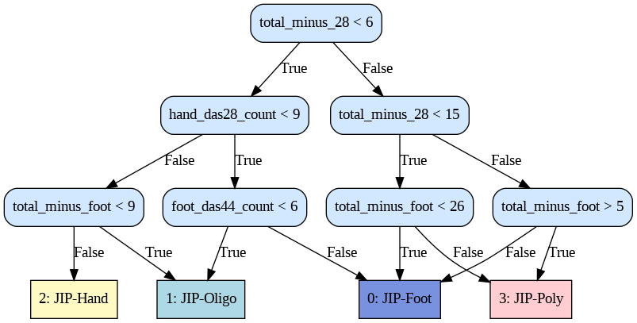
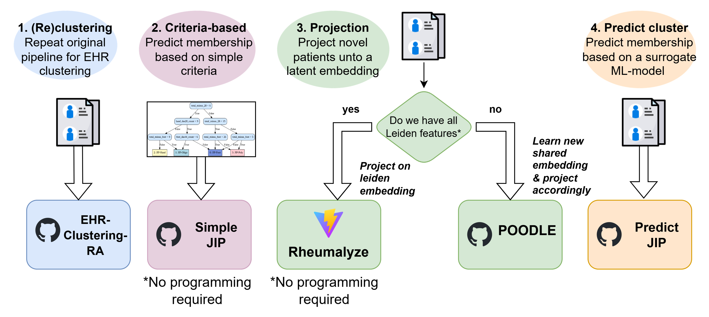

# SimpleJIP
JIPs stratify rheumatoid arthritis patients into four phenotypes based on affected joint distribution: JIP-foot (predominantly foot involvement), JIP-oligo (few affected joints), JIP-hand (predominantly hand involvement), and JIP-poly (many affected joints). These patterns correspond to differences in treatment outcomes and synovial histology. For more information on the clinical relevance of JIPs, see our study: https://www.nature.com/articles/s41746-025-01997-1 

To facilitate the use of Joint Involvement Patterns (JIPs) in research, we developed a simple decision tree to discern between the JIPs. You only need to sum the number of affected joints in four regions of interest.

This means you can assign patients without the need for any programming knowledge. Though we have included an example Python script for reference if you want to employ it on a large number of patients at once (src/jip_criteria_example_code.py)

## Example assignment.
See example patient assignment below: 

In the image above you can see an example of a patient being assigned to one of the joint involvement patterns. This is simply done by summing the joints (count both swollen and tender) in the regions of interest. And then following the tree from top to bottom, where you’ll arrive at the respective joint involvement cluster.

Note: The simplified JIPs were validated against the original study, showing high correspondence (>80%) and consistent trends in clinical outcomes (see notebook).

## The JIP criteria
The JIP criteria use a decision tree like structure, based on only joint counts, which means you can assign patients (no Python or machine learning setup) needed. We've included an example script for reference.

The four regions of interest are as follows:

### 1. `hand_das28_count` 
* **Definition:** The sum of MCP and pip joints in the hand (i.e. the hand joints measured within the DAS28 scheme).
* **Components:** `JC_PIP` (Proximal Interphalangeal) + `JC_MCP` (Metacarpophalangeal).
* **Clinical Role:** Acts as the reference region for hand-specific involvement.

### 2. `foot_das44_count` 
* **Definition:** The sum of foot (MTPs) and ankle joints. (These are the lower extremity joints in DAS44 scheme)
* **Components:** The sum of MTPs and ankle joints (or `SJC44_FOOT` (Swollen) + `TJC44_FOOT` (Tender))
* **Clinical Role:** Isolates lower extremity involvement, which is often excluded from standard DAS28 assessments.

### 3. `total_minus_foot`
* **Definition:** The total joint count minus the foot joints.
* **Formula:** `JC` - `foot_das44_count`
* **Purpose:** Measures activity in all body regions except the feet. This helps the classifier identify if inflammation is widespread or if it is sparing the lower extremities.

### 4. `total_minus_28`
* **Definition:** The total joint count minus the standard 28 joints as defined by DAS28 scheme.
* **Formula:** `JC` - `JC28`
* **Purpose:** Captures "extra" joint involvement. A high value indicates significant disease activity in joints not typically monitored by the most common clinical score (DAS28), such as the feet or hips.

---

## Directory Structure
* `README.md`: This file
* `Manual_How to detect JIPs_v2.pdf`: User manual with extra information on the different ways to infer the JIPs
* `figures/md`: Figures used for the readme
* `src/*`: Reference code and lists of joints to counts
  * `src/DAS28_joints.py`: Contains lists of DAS28 joints for each anatomical location (based on Leiden EHR naming convention) 
  * `src/DAS44_joints.py`: Contains lists of DAS44 joints for each anatomical location (based on Leiden EHR naming convention)
  * `src/DAS66_joints.py`: Contains lists of DAS66 joints for each anatomical location (based on Leiden EHR naming convention) 
* `Simplified_JIP_classification_Leiden.ipynb`: Example code/ notebooks showing how to apply the JIP criteria

## Overview of JIP-related Github Repo's
As alternative to using the criteria, you may also refer to our other JIP related github repo's, where we have the full pipeline -> or surrogate probablistic MLs to predict JIPs (that align more with the original study). Although you could argue these simplified JIPs capture the essence better - as they are exclusively based on joints.

### Different ways to detect the JIPs
In order to identify JIPs, you have three options: 
1. (Re)clustering : run entire cluster analysis again, see our original clustering pipeline [EHR-clustering](https://github.com/levrex/EHR-Clustering-RA)
2. Projection : use our client-based webtool [Rheumalyze](https://knevel-lab.github.io/Rheumalyze/) or project patients on custom made latent space using [POODLE](https://github.com/levrex/Poodle)  
3. Prediction : use a surrogate technique to predict the JIP cluster
[PredictJIP](https://knevel-lab.github.io/PredictJIP/)

## Contact
If you experience difficulties with implementing the pipeline or if you have any other questions feel free to send me an e-mail. You can contact me on: t.d.maarseveen@lumc.nl 
